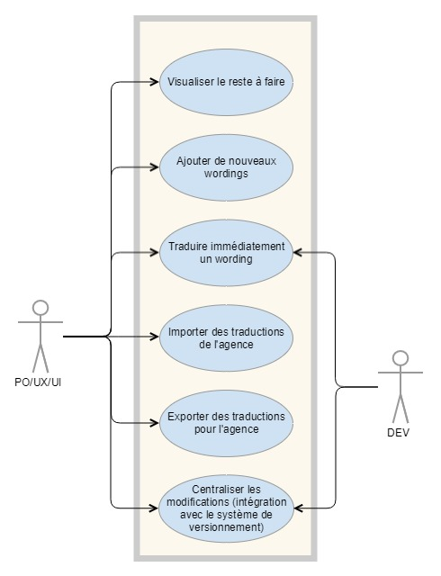
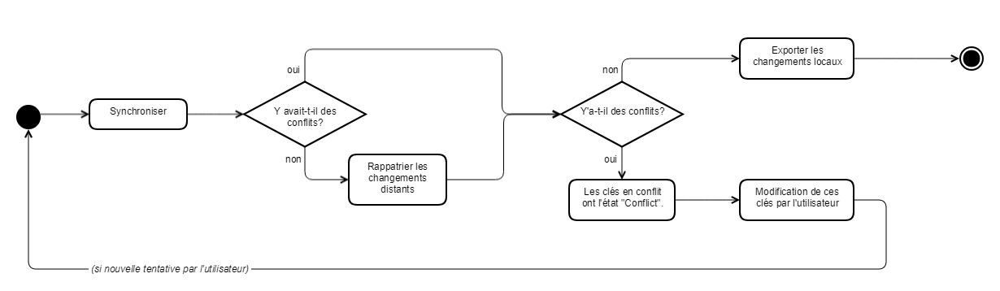

title: Documentation fonctionnelle

# API

L'API est documentée par un fichier Swagger (voir repo).

# Fonctionnalités

## Visualiser le reste à faire

A chaque clé est associé un état permettant le filtrage de celle-ci, et une visualition de ce qu'il reste à traduire. Un système de tags permet de modifier cet état.

Par exemple : la traduction `Contenu d'une clé [TODO]` a l'état `TODO`.

L'état de la clé (ensemble des traductions) est l'état le plus "critique" parmi les états des traductions : plus critique = `TODO` > `INPROGRESS` > `DONE` = moins critique.

Une traduction vide a l'état `TODO` (et donc la clé associée aussi).

## Ajout de wordings et langues

La modification (ou l'ajout – l'opération est la même) d'un wording est possible. Les fichiers contenant les clés sont modifiés. Note : l'ordre des clés n'est pas forcément le même dans le fichier final.

On peut également ajouter une langue à un Keyset. Cela ne fait qu'ajouter un nouveau fichier comprenant les clés du Keyset ciblé, et leur associe des traductions vides : `wording.hello=`.

## Traduire immédiatemment

Il est possible de traduire directement une clé à l'aide d'un service externe (Google Translate). Comme précédemment, les fichier sont directement écrits. 

Un tag `TODO` est ajouté à la traduction obtenue.

## Importer et exporter des traductions

L'export rassemble les traductions françaises de toutes les clés `TODO` ou `INPROGRESS` dans un fichier CSV (une seule colonne).

La correspondance entre chaque ligne et ses informations techniques (projet, keyset, identifiant de clé) est sauvegardée en base, et ces données peuvent être récupérées à l'aide du numéro d'export.

L'import modifie directement les fichiers également.

## Centraliser les modifications

Les modifications des fichiers sont centralisées en passant par un système de versionnement comme Git.

Cela se traduit par la fonctionnalité de synchronisation (cf. Swagger).

Deux cas de figure : si le rappatriement des changements distants échouant, des clés passent dans l'état `CONFLICT`. Une fois les conflits résolus en modifiant les clés en conflit, il est possible de synchroniser à nouveau.

Sinon, les changements locaux sont partagés (et les changements distants sont rappatriés).

