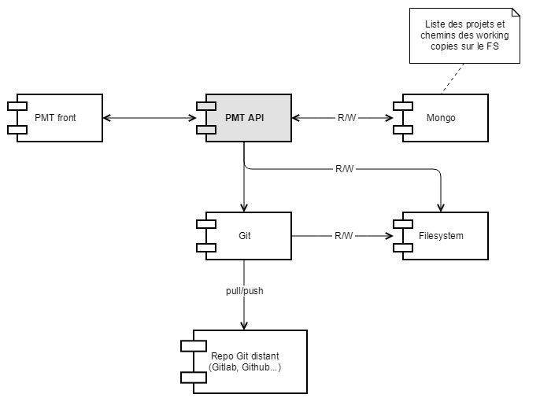
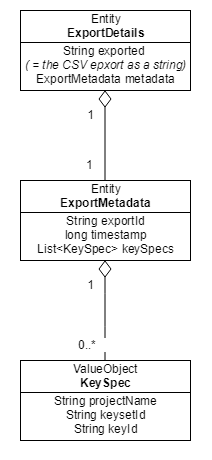
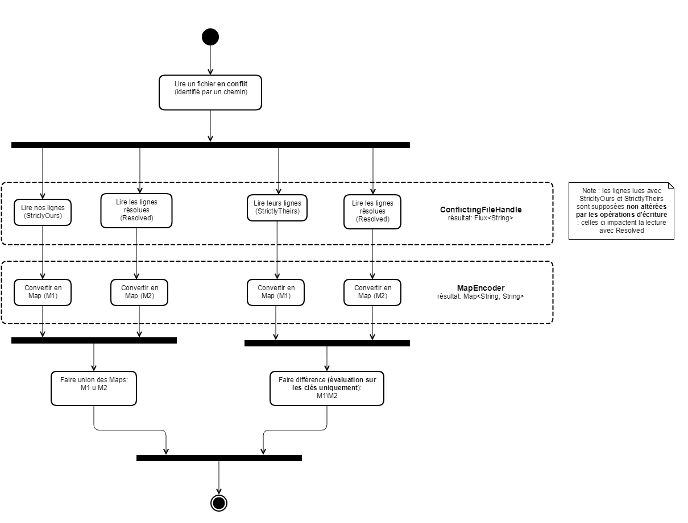
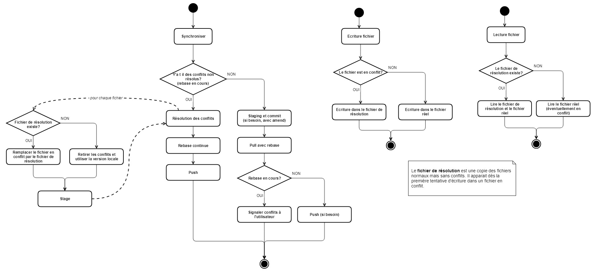

title: Documentation technique

# Architecture logique


 
L'API utilise Mongo pour stocker des métadonnées uniquement. Les vraies données sont lues à partir de repo clonés via l'app. L'API interragit avec Git, mais d'autres VCS devraient pouvoir être implémenté.

# Concepts
 
Côté base de données, on ne garde que les métadonnées des Project/Keyset/Key. Les objects `Project`, `Keyset` et `Key` sont fournis en réponse par l'API Rest (cf Swagger).

```{json}
{
    "state": "Conflict",
    "translations": {
        "FR": [
            "Annuler"
        ],
        "DE": [
            "stornieren"
        ],
        "ES": [
            "Anular"
        ],
        "EN": [
            "Cancel",
            "Something else"
        ]
    }
}
```

Une `Key` est la donnée d'un état de clé (à traduire = _TODO_, traduction demandée = _INPROGRESS_...) et de traductions (correspondance langue et liste de chaînes – la liste comporte une valeur en cas général, et deux quand un conflit survient).

Un `Keyset` agrège un ensemble de clé ensemble, et fournit quelques données supplémentaires (nom, id, langages pris en compte...). Finalement, un `Project` agrège divers `Keyset`.

Côté représentation interne, `ProjectMetadata` et `KeysetMetadata` permettent de reconstruire les entités correspondantes.

Le `KeysetMetadata` donne les chemins des fichiers de traduction qui contiennent les clés d'un `Keyset`. Par exemple, un fichier va contenir les traductions en anglais et un autre les traductions en allemand, et ce pour les mêmes clés techniques.



Les exports sont gérés via deux entités. L'entité `ExportDetails` contient l'export CSV ainsi que des métadonnées (sauvées en base) qui permettent de retrouver l'export.

Il faut en effet conserver des infos sur l'export (d'où `KeySpec` notamment qui redonne le "chemin" complet vers une clé: projet, keyset, identifiant) car l'export ne contient que du texte brute, aucune métadonnée.

# Lecture et écriture de fichiers avec gestion de conflits

> _Remarque. Ici, on utilise le vocabulaire git ou presque, mais l'abstraction devrait pouvoir s'appliquer à d'autres systèmes de versionnement._

Les étapes pour la lecture : (géré par `FileHandler`)

* **lecture des lignes** (fichier → `Flux<String>`) : assuré par `ConflictingFileHandle`; un drapeau (`ConflictFlag`) indique si l'on veut lire nos lignes (`ConflictFlag.StrictlyOurs`) ou les lignes upstream s'il y a des conflits (`ConflictFlag.StrictlyTheirs`), ou encore les lignes en commun (`ConflictFlag.Solved`), `null` peut être utilisé au lieu d'un drapeau s'il n'y a pas de conflit;
* **traduction en dictionnaire** (`Flux<String>` → `Map<String, String>`) : un `MapEncoder` "adapté" (critère : extension du fichier) traduit le flux de lignes en dictionnaire (implémenté : json, properties);
* **adaptation** : opération de diff au niveau des `Maps` selon que l'on veuille lire la version upstream ou la notre, détails ci dessous;
* **conversion en `Keyset`** : utilisation de `Keyset.fromMaps` pour obtenir une entité du domaine pour traitement fonctionnel.

Pour l'écriture, c'est l'inverse : `Map` vers `Mono<String>` (note : `Flux<String>` en lecture pour épargner du travail aux formats qui utilisent les sauts de lignes) vers fichier.

Une classe `AsyncFile` dans le package `infrastructure` permet de lire les fichiers de manière asynchrone en produisant des flux Reactor.

> _Remarque. Les `MapEncoder` sont très simples : ils ne font que de l'encodage et du décodage entre flux de chaînes et dictionnaire. En particulier, ils ne doivent pas décrire plus précisemment le processus de décodage, et **ne savent donc pas décoder des fragments de fichiers**. Il faut donc lire deux versions distinctes des fichiers, et (re)faire le diff au besoin sur les dictionnaires._

Plus précisemment, la lecture se fait ainsi :

* **lecture de notre version** : s'il y a des conflits, on lit nos lignes (strictement) + les lignes en commun; sinon on lit juste notre fichier
* **lecture de leur patch** : on lit leurs lignes (strictement), en retirant ce qui est résolu

En résumé :



# Interprétation des drapeaux dans le cas de Git

La lecture se passe ainsi : on lit le fichier, en mappant chaque ligne vers un `ConflictMark`.

```{json}
{
  "foo": "bar",
  <<<<<<< ...
  "conflict": "v1",
  =======
  "conflict": "v2",
  >>>>>>>
}
```

Devient : 

```
ConflictMark.NONE
ConflictMark.NONE
ConflictMark.START
ConflictMark.NONE
ConflictMark.SPLIT
ConflictMark.NONE
ConflictMark.END
ConflictMark.NONE
```

Puis on répète la marque précédente quand on a `NONE`.

```
ConflictMark.NONE
ConflictMark.NONE
ConflictMark.START
ConflictMark.START
ConflictMark.SPLIT
ConflictMark.SPLIT
ConflictMark.END
ConflictMark.END
```

Ainsi, la lecture avec drapeau `StrictlyOurs` correspond au lignes mappées vers `START`, `StrictlyTheirs` à celles mappées vers `SPLIT`.

Le drapeau `Resolved` correspond pour sa part aux lignes mappées vers `END` ou `NONE`, ou à la lecture simple d'un fichier de résolution s'il existe.

# Synchronisation dans le cas de Git

